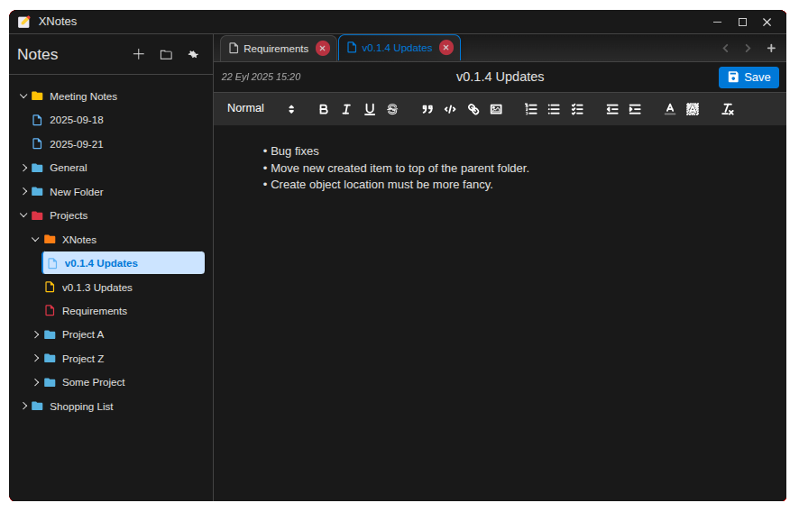

# XNotes - A Simple and Clean Note-Taking App

XNotes is a desktop note-taking application built with Electron. It offers a clean, minimalist interface for writing and organizing notes with rich text formatting, folder-based organization, and syntax highlighting for code snippets.

## Features

- **Rich Text Editor**: Utilizes Quill.js for a powerful and intuitive word-processor-like experience.
- **Folder-Based Organization**: Organize your notes into folders and sub-folders.
- **File Explorer**: A sidebar provides a tree view of your notes and folders for easy navigation.
- **Advanced Drag & Drop**: Complete reordering system with cross-folder support and visual feedback.
- **Live HTML Preview**: Instantly see how your formatted notes will look.
- **Syntax Highlighting**: Supports syntax highlighting for various programming languages in code blocks, powered by `highlight.js`.
- **Dark & Light Themes**: Switch between dark and light modes to suit your preference.
- **Customizable Settings**: Adjust the theme, font family, font size, and more.
- **Context Menu**: Right-click menus for file operations and customization.
- **Customizable Icon Colors**: Personalize your workspace with colored icons for files and folders.
- **Local Storage**: Notes are stored locally on your machine in the `~/Documents/XNotes` directory.
- **Cross-Platform**: Can be built for Linux, Windows, and macOS.

## Getting Started

### Prerequisites

- [Node.js](https://nodejs.org/) (v14 or later)
- [npm](https://www.npmjs.com/) or [yarn](https://yarnpkg.com/)

### Installation

1.  Clone the repository:
    ```bash
    git clone https://github.com/sundowatch/x-note.git
    cd x-note
    ```

2.  Install the dependencies:
    ```bash
    npm install
    ```

### Running the Application

To run the application in a development environment:
```bash
npm run dev
```
This will start the application with hot-reloading enabled, which automatically restarts the application when you make changes to the source code.

To run the application as it would be in production:
```bash
npm start
```

## Building from Source

You can build the application for different operating systems using the following commands. The built files will be located in the `dist/` directory.

- **Build for all platforms (Linux, Windows, Mac):**
  ```bash
  npm run build:all
  ```

- **Build for Linux only (`.deb`, `.AppImage`):**
  ```bash
  npm run build:linux
  ```

- **Build for Windows only (`.exe` installer, portable):**
  ```bash
  npm run build:win
  ```

- **Build for macOS only (`.dmg`):**
  ```bash
  npm run build:mac
  ```

## Usage

-   **File Explorer**: The sidebar on the left displays all your notes and folders. You can right-click to create, rename, or delete notes and folders.
-   **Drag & Drop Reordering**: Drag files and folders to reorder them within the same directory or move them to different folders. Visual indicators show where items will be placed.
-   **Editor**: Click on a note in the file explorer to open it in the main editor. Use the toolbar at the top to apply formatting like bold, italics, lists, and code blocks.
-   **Context Menu**: Right-click on any file or folder to access additional options like rename, delete, duplicate, and color customization.
-   **Settings**: Access the settings by clicking the vertical ellipsis (⋮) icon. Here you can change the theme, font, and other editor settings.
-   **Auto-Save**: Your notes are saved automatically as you type, so you don't have to worry about losing your work.

## Technologies Used

-   **[Electron](https://www.electronjs.org/)**: For building the cross-platform desktop application.
-   **[Quill.js](https://quilljs.com/)**: As the rich text editor component.
-   **[highlight.js](https://highlightjs.org/)**: For syntax highlighting in code blocks.
-   **[Marked](https://marked.js.org/)**: For converting Markdown to HTML (used for preview).

## Project Structure

```
xnotes/
├── assets/            # Static assets (icons, fonts)
├── build/             # Build-related scripts and assets
├── src/               # Application source code
│   ├── main.js        # Electron main process
│   ├── renderer/      # Renderer process files (UI)
│   ├── styles/        # CSS stylesheets
│   └── utils/         # Utility modules
├── package.json       # Project metadata and dependencies
└── README.md          # This file
```

## Screenshots

Here's a glimpse of XNotes in both light and dark modes.

| Light Mode | Dark Mode |
| :---: | :---: |
|  |  |

## Setup Files

### Linux
- [xnotes_0.1.2.zip](setup/linux/xnotes_0.1.2.zip) (ZIP Archive)
- [xnotes_0.1.2_amd64.deb](setup/linux/xnotes_0.1.2_amd64.deb) (Debian Package)
- [XNotes-0.1.2.AppImage](setup/linux/XNotes-0.1.2.AppImage) (AppImage)

### Windows
- [XNotes_Setup_0.1.2.exe](setup/windows/XNotes_Setup_0.1.2.exe) (Windows Installer)
- [XNotes 0.1.2.exe](setup/windows/XNotes%200.1.2.exe) (Executable)

## Version History

### Version 0.1.2 (2025-09-21)
**New Features:**
- **Advanced Drag & Drop Reordering**: Complete reordering system for files and folders
  - Cross-folder drag and drop with intelligent positioning
  - Visual reorder indicators and ghost elements
  - Immediate activation without hover delays
  - Persistent order configuration with `.xnotes-order.json` files
- **Enhanced File Management**: 
  - Preserve icon colors during move operations
  - Prevent invalid operations (moving folder into itself)
  - Improved error handling for file operations
- **Performance Optimizations**:
  - Optimized event listeners to prevent memory leaks
  - Settings synchronization for color persistence
  - Cleaner drag state management

### Version 0.1.1 (2025-09-20)
**New Features:**
- **Drag & Drop**: Enhanced file management with drag and drop functionality
- **SVG Icons**: Replaced PNG icons with scalable SVG icons for better quality
- **Context Menu**: Added right-click context menu for improved user interaction
- **File Operations**: 
  - Rename files and folders
  - Delete files and folders  
  - Duplicate files and folders
- **Customizable Icon Colors**: Ability to change icon colors to match your preference

## License

This project is licensed under the MIT License. See the `LICENSE` file for details.
